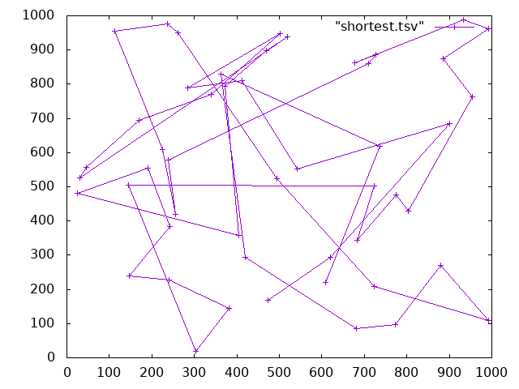
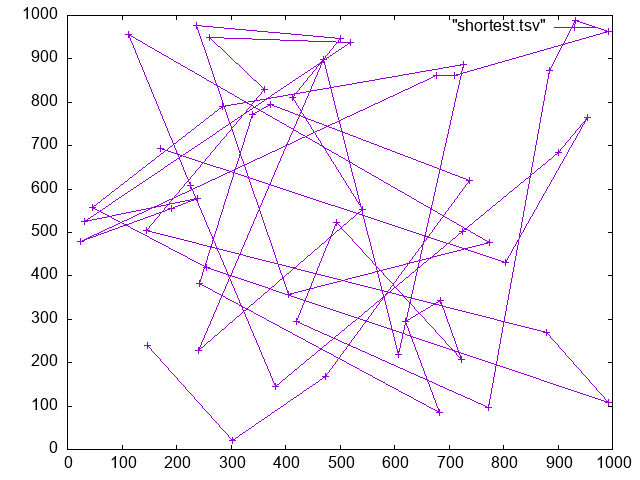
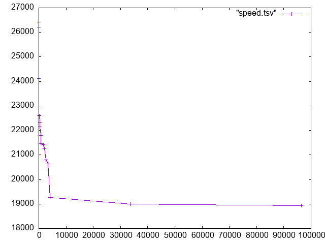

# HW 11: Traveling Salesperson Problem Part 3

**By: Aadit Bagdi, Cole Nemec, Julian Prince, and Taylor Blair**

# `ClimbChromosome`

## `mutate()` 

## `clone()`

# `Tournament Deme` 

# Report the Results! 

 

With the update we were able to achieve a path of 12,492.6 in 9,500 iterations.

For context, here is the previous best route and time it took
 
*The* `shortest.tsv` *in the upper right is a formatting mistake.*

It took 100,000 iterations to find that route.

# Notes

We would like to give a special thanks to the following individuals for their assistance in both outlining, coding, and rubber ducking our code:
 + [Eitan Frachtenberg](https://github.com/eitanf)
	 + All files named
 + [David Ramirez](https://www.reed.edu/faculty-profiles/profiles/ramirez-david.html)
	 + `get_best`
	 + `calculate_fitness`
	 + `README.md`
 + Ian Wahbe
	 + `recombine`
